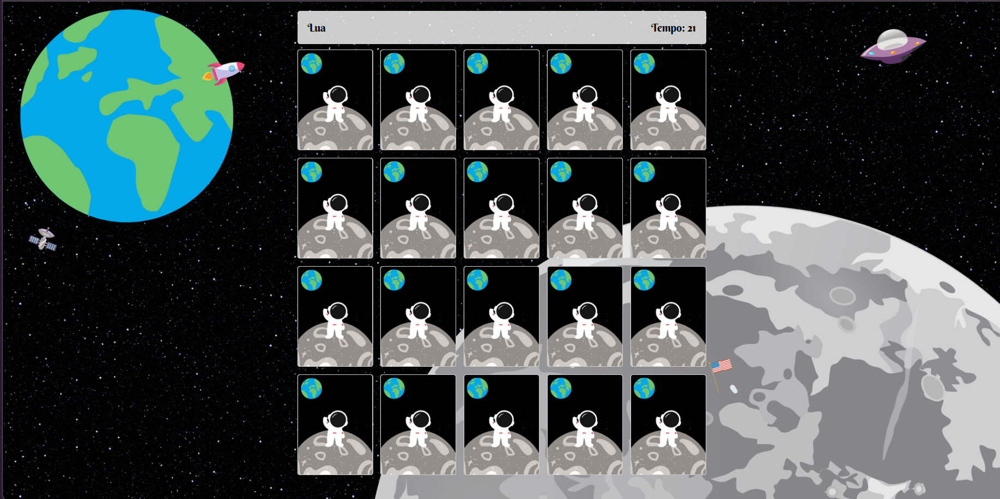

# 🌙 Fases da Lua — Jogo da Memória

Jogo da memória desenvolvido com **HTML, CSS e JavaScript** durante meus estudos de desenvolvimento Front-end.

O projeto foi criado acompanhando um tutorial em vídeo e posteriormente personalizado por mim com o tema **Fases da Lua**.

---

## 📸 Preview

  

  

---

## 💻 Sobre o projeto

O **Fases da Lua** é um jogo da memória desenvolvido como projeto de estudo para praticar conceitos de **HTML, CSS e JavaScript**.

O desenvolvimento foi realizado acompanhando um tutorial, utilizando o projeto como base para compreender a estrutura e a lógica de funcionamento de um jogo da memória.

A partir dessa base, personalizei o projeto com minha própria temática e identidade visual, transformando-o no **Fases da Lua**.

---

## 🛠️ Tecnologias utilizadas

- HTML5
- CSS3
- JavaScript

---

## ✨ Funcionalidades

- Tela inicial para identificação do jogador
- Campo para inserir o nome
- Validação antes de iniciar a partida
- Jogo da memória
- Identificação de pares
- Interface personalizada
- Interações utilizando JavaScript

---

## 🚀 Acesse o projeto

🔗 [Visualizar projeto](https://luutsuk.github.io/Fases-da-Lua/)

💻 [Ver código no GitHub](https://github.com/LuuTsuk/Fases-da-Lua)

---

## 📚 O que pratiquei

Durante o desenvolvimento deste projeto, pratiquei:

- Estruturação de páginas com HTML
- Estilização utilizando CSS
- Manipulação do DOM
- Eventos em JavaScript
- Funções
- Validação de campos
- Lógica de programação
- Interação entre HTML, CSS e JavaScript
- Personalização visual de um projeto existente

---

## 🎓 Referência utilizada

Este projeto foi desenvolvido acompanhando o tutorial:

📺 [Assistir ao vídeo utilizado como referência](https://youtu.be/NV88N1r2Qkg)

O tutorial foi utilizado como material de estudo para compreender a construção e a lógica de um jogo da memória com JavaScript.

A versão presente neste repositório foi personalizada por mim com o tema **Fases da Lua**.

---

  Projeto desenvolvido para fins de estudo e prática de Front-end. 🌙

